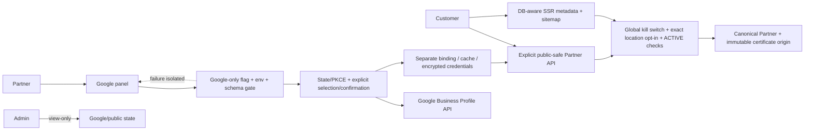

# Architecture — AFTER — Public Partner Network + Google Partner Presence

**State:** AS BUILT / LOCALLY VERIFIED (not deployed)
**Date:** 2026-08-19

## Deliberately unchanged

- Grading, QA, certificates, cards, credits, stations, payments and Partner authentication authorities.
- Google cannot publish a location, change canonical MintVault address, or gate the Partner Portal.
- No reviews, ratings, hours, services or coordinates are invented.

## AS-BUILT confirmation

- The public surface uses an explicit allowlisted SQL/DTO and one shared publication decision; legal names and private management objects never become fallback public data.
- Google config/schema/provider failure is route-local. The portal-wide readiness/schema gates remain unchanged.
- 0101 is additive, forced-RLS, migration-inventory classified, applied and rolled back only in disposable PostgreSQL.
