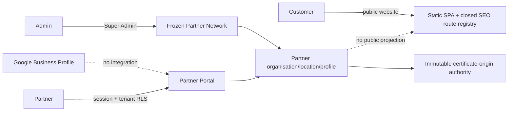

# Architecture — BEFORE — Public Partner Network + Google Partner Presence

**Date captured:** 2026-08-19
**Captured from:** `origin/main@facfd36f`, live `/api/version`, Fly status/secrets inventory, SELECT-only production schema/flag aggregates, Graphify and source tracing.

## Current facts

- Partner/location have stable `public_ref`; no public directory API/page or publication flag exists.
- Public SSR recognition and sitemap are static; unknown paths are real 404/noindex.
- Google credentials, schema, OAuth code and provider access proof are absent.
- Optional Google must not enter whole-portal env/schema gates.
