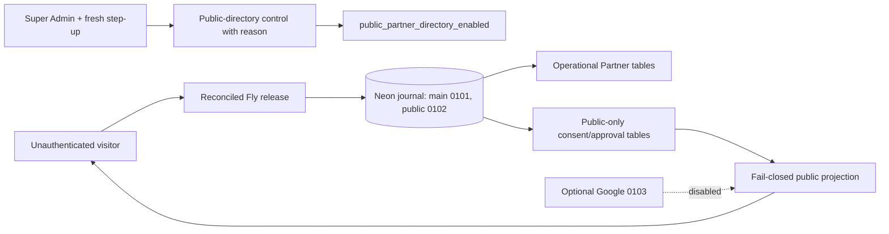

# Architecture — AFTER — Public Partner Network v1 final production release

**State:** AS-BUILT LOCALLY; NOT DEPLOYED
**Date:** 2026-08-20

| Change | Why | Class |
|---|---|---|
| Preserve Growth 0101; public schema follows as 0102; Google follows as optional 0103. | Immutable migration identity. | E |
| One shared structured-data serializer renders Growth and Partner SEO metadata. | Retain both public authorities. | B |
| Settings gains a stepped-up reasoned public exposure/kill switch. | Safe activation and containment. | B/G |

No public flag is turned on, schema applied, Partner reset, payment mutated, or Google provider action taken by this code-reconciliation stage. Production still requires the owner to approve the revised `0101` + `0102` scope, expressly excluding `0103`.
