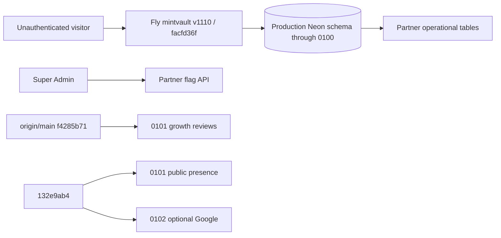

# Architecture — BEFORE — Public Partner Network v1 final production release

**Date captured:** 2026-08-20
**Captured from:** fresh `git fetch origin`, candidate/main merge-tree, Fly release/machine reads, production `/api/version`, and a repeatable-read production schema/journal/flag inspection.

| Fact | Evidence |
|---|---|
| Production serves `facfd36f`, v1110, 2/2 machines healthy. | `/api/version`, `fly releases`, `fly machines list` at Stage 0. |
| Production journal has independent `0091`–`0100`, but no public tables/0101. | Repeatable-read production inspection. |
| Main and candidate both use numeric 0101 for different migration bodies. | `origin/main:migrations/0101_growth_reviews_and_conversion.sql`; candidate `0101_partner_public_presence.sql`. |
| Candidate lacks an operator public-directory kill switch. | Mounted UI/source review; server has the secured endpoint. |

The operational Partner address and public values remain separate; no public exposure is live in production.
