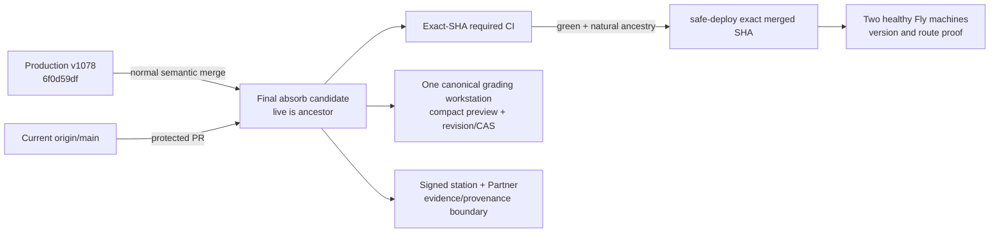

# Architecture — AFTER — Canonical grading live absorb

**State:** AS-BUILT locally (Stage 6; release pending)
**Date:** 2026-08-14

## What changes vs BEFORE

| Change | Why | Classification |
|---|---|---|
| Live commit becomes a natural ancestor of the release candidate | Prevent direct deployment from losing live-only Partner/scanner/runtime behavior. | G |
| Candidate's one-workstation composition remains the sole grading UI | Preserve hostile-reviewed canonical UI and compact preview. | B |
| Live Partner/scanner/authority behavior is retained through semantic conflict resolution | Preserve production functionality and security boundaries. | B |

## What deliberately does NOT change
- MVGS maths, centering, Pristine/Black Label, printability rules and grading thresholds.
- Migration history, schema, secrets, auth/payment behavior, or production data.
- The protected reviewer worktrees and the dirty shared root.

## AS-BUILT confirmation
- The normal merge has two parents: reviewed candidate `90f90625` and live `6f0d59df`; the content result is candidate-equivalent because the four-way comparison showed the live runtime fixes are already present in current-main/candidate while the candidate retains newer release-rate limiting.
- Category A live behaviour retained: captured-card queue restriction (`6f0d59df`), signed-station recovery (`cd7a37e1`), certificate-detail scope (`f3e90e63`), credit-to-print completion (`682b9b27`), Partner grading/station capture hardening (`9821fc46`), hardened 0074 identity (`a520b9da`), and server-authoritative grades (`77b075a5`). No category B redesign, C deletion or D out-of-scope change was accepted.
- One shell, one panel, one viewer and five capability adapters remain. The release tree has no MVGS/centering/Pristine source delta.
