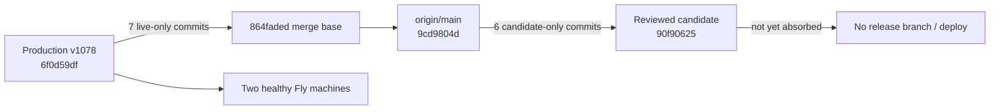

# Architecture — BEFORE — Canonical grading live absorb

**Date captured:** 2026-08-14
**Captured from:** `flyctl releases --app mintvault`, `flyctl machines list --app mintvault`, public `/health`, `/ready`, `/api/version`, and the local git ancestry graph.

## Scope of this snapshot
The production release lineage, the reviewed canonical workstation candidate, and the protected CI/deployment boundary.

## Current state facts (evidenced)

| Fact | Evidence |
|---|---|
| Production serves `6f0d59df` on release v1078 | `/api/version` and `flyctl releases` at Stage 0 |
| Both production machines use the same image and are healthy | `flyctl machines list --app mintvault` |
| Candidate and production diverge at `864faded` | `git merge-base 6f0d59df 90f90625` and directional count `7 7` |
| Candidate contains current main | `git merge-base origin/main 90f90625 = 9cd9804d`, directional count `0 6` |

## Known constraints in this area
- Preserve the canonical single workstation, revision/CAS authority, compact preview and scanner/station evidence boundary.
- Do not alter MVGS scoring, centering, Pristine/Black Label rules or printability authority.
- Use a normal PR and the canonical safe deploy procedure only after CI, natural live ancestry and migration checks pass.
