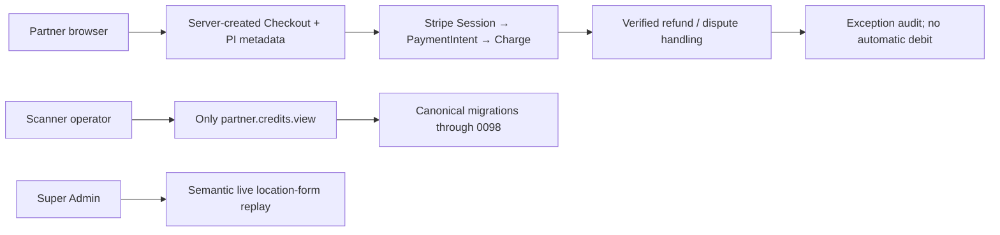

# Architecture — AFTER — canonical lineage final freeze

**State:** AS-BUILT (local candidate; not activated)
**Date:** 2026-08-19

## What changed vs BEFORE

| Change | Why | Classification |
|---|---|---|
| Explicit inclusive Stripe Price validation before checkout/grant. | Locked price must remain VAT-inclusive. | F |
| Server-owned metadata copied to PaymentIntent; dispute re-reads its Charge. | Correct refund/dispute audit attribution. | F |
| `0098` gives Scanner operator only credit view. | Least-privilege zero-credit visibility. | E |
| Current location-form behavior replayed semantically. | Retain new production behavior without divergent merge. | C |

## Deliberately unchanged

No Stripe configuration, payment charge, migration journal, deployment image, external provider,
authentication, MVGS, R2, or customer data changed.

## AS-BUILT confirmation

Targeted tests and hostile re-review prove the local source behavior. Production activation remains
outside this freeze and requires owner approval.
