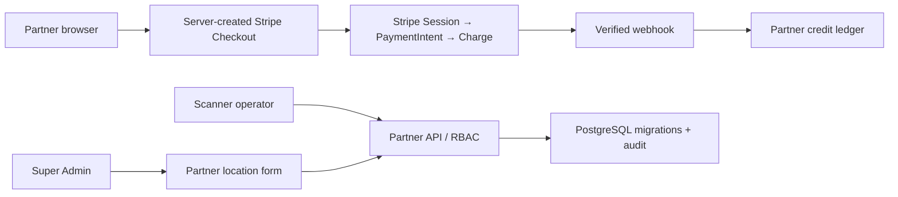

# Architecture — BEFORE — canonical lineage final freeze

**Date captured:** 2026-08-19
**Captured from:** read-only git lineage, production `/api/version`, production-journal evidence,
migration runner/rehearsal tests, and Partner/Scanner/Stripe source.

## Scope

Canonical branch reconciliation around Partner credit purchase, Scanner credit visibility, migration
ownership, and live location-form behavior.

| Fact | Evidence |
|---|---|
| Production had 41 recorded migrations and live commit changed during the freeze. | Read-only journal report and `/api/version`. |
| Active Partner/Scanner head contained `0098` and pricing changes after the prior candidate. | Git commit inventory `ae7fd387..72f57963`. |
| Checkout metadata alone could not satisfy Charge-based refund/dispute audit. | Stripe model trace and hostile reproduction. |

## Constraints

No browser price authority, no cross-tenant credit purchase, verified payment transition only,
forward-only migration journal, Scanner role least privilege, no production mutation without owner approval.
