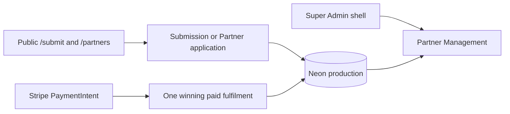

# Architecture — BEFORE — GB-04 final production Growth Command

**Date captured:** 2026-08-19
**Captured from:** canonical `cf891246`, production release v1107, and the completed 62-entry migration journal proof.

## Scope

The existing Super Admin shell, canonical submission paid transition, GB-03 `partner_applications` table, and the public `/submit` / `/partners` acquisition routes.

## Current state facts

| Fact | Evidence |
|---|---|
| Paid rows use `payment_status='paid'`; no client event is payment authority. | Canonical `fulfilPaidSubmission` and `markSubmissionAsPaid`. |
| Payment amount/timestamp columns exist but canonical paid transition does not populate them. | `shared/schema.ts` and current `server/storage.ts`. |
| GB-03 applications are durable and status-constrained, but have no Growth operator routes. | `partner_applications` schema and `server/partner-applications.ts`. |
| Super Admin uses the shared `AdminShell`; `/admin/growth` does not exist on canonical main. | `client/src/App.tsx` and `admin-shell.tsx`. |
| The old GB-04 candidate contains a valid first-party aggregate design but its `0097` migration conflicts with canonical ownership. | Old `d3d02dc6` diff and canonical migration inventory. |

## Constraints

- Attribution is optional and must never interrupt submit, payment, or Partner application capture.
- Revenue comes only from Stripe-verified paid transitions.
- Growth lead actions cannot create Partner organisations, users, wallets, stations, or approvals.
- All Growth API reads/writes are Super Admin only; aggregate reporting exposes no PII.
