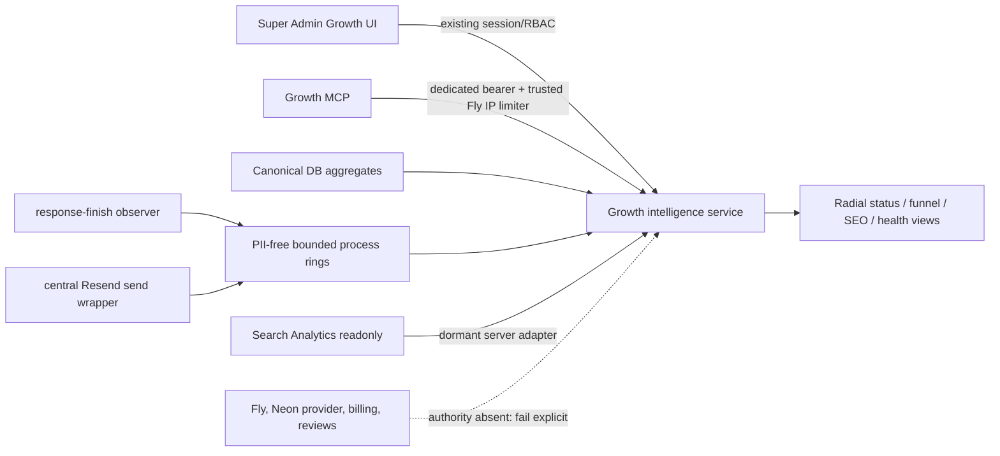

# Architecture — AFTER — GB-04D Growth Command

**State:** AS BUILT LOCALLY — release activation pending
**Date:** 2026-08-20

The new telemetry stores timestamps, rounded durations, numeric status classes and fixed service/outcome enums only. It is current-process evidence, never visitor/session or fleet telemetry. Canonical conversion events now supply three funnel rates, paid cards/order, deterministic drop-off and a like-for-like prior-period comparison. Database readiness now also supplies timed application latency and current-process pool pressure.

Search Console uses a hard-allowlisted property, server-only service-account JWT, read-only scope, seven-second timeouts, final data, bounded rows, 15-minute cache and 24-hour visibly stale fallback. It is dormant without owner-created property/read identity secrets.

No provider-write client, infrastructure control, automatic mode, secret change, migration or protected auth/payment semantic change exists in the as-built graph. The canonical handover is `docs/growth/GB-04D-GROWTH-COMMAND-HANDOVER.md`.
