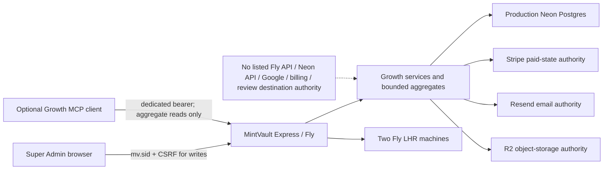

# Architecture — BEFORE — GB-04D Growth Command

**Date captured:** 2026-08-20
**Captured from:** fetched Git authority, `/api/version`, `fly status`, `fly releases`, `fly machine status`, `fly secrets list`, prior production handover and current source inventory.

## Scope

The live Growth Command, adjacent Command Centre, server-side provider/data authorities, production Fly/Neon runtime, and the read-only MCP boundary.

## Current evidenced facts

| Fact | Evidence |
|---|---|
| Production serves `ee7fbe43`, Fly v1112 | `/api/version`, `fly releases` |
| Current main is an ancestor of production | Git merge-base/log reconciliation |
| Two production machines are started and passing | `fly status`, `fly machine status` |
| Growth/review/intelligence routes return authenticated 200s in production | bounded current Fly log observation |
| Existing UI truthfully reports provider gaps | released Growth handover/live prior acceptance |
| Only listed provider credentials can be treated as existing authority | `fly secrets list` names only; values never read |

## Constraints

- Provider tokens remain server-side and never enter browser/MCP responses.
- Payment status remains Stripe-authoritative; customer declines are not platform incidents.
- Partner/Scanner expected authorization refusals are not service failures.
- MCP remains aggregate-only and cannot mutate infrastructure, targets, money, credits or providers.
- No request count is labelled as a visitor/session.
- No infrastructure control may spend or scale during proof without separate approval.
- Any unavailable signal renders `UNKNOWN`, `NOT CONNECTED`, `NOT INSTRUMENTED`, or `INSUFFICIENT DATA`; never synthetic green.
