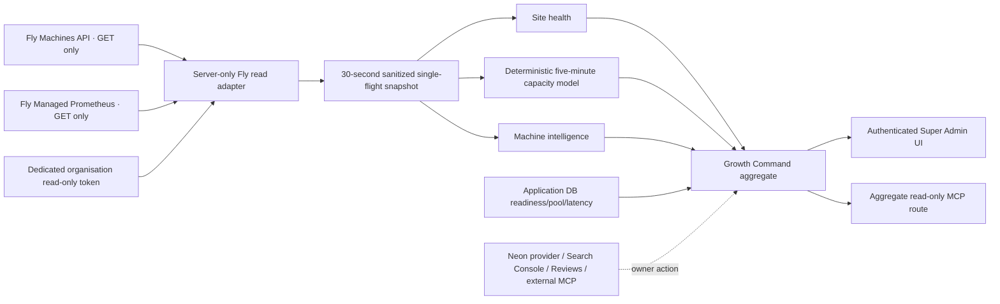

# GB-04E architecture — as built before provider activation

- The adapter hard-allowlists organisation `personal`, app `mintvault`, the Machines API host and Managed Prometheus host. Redirects and non-GET methods are unavailable.
- Raw provider responses, check output, image digests and credentials do not cross the adapter boundary.
- CPU, RAM, request rate, p95 and 5xx are five-minute provider signals. Missing any expected-machine signal makes capacity UNKNOWN. Request rate is context only.
- The approved fleet floor remains two machines. A lost/unhealthy machine recommends restoring the fleet before any capacity action.
- Successful data is cached for 30 seconds. A failed refresh may display the last successful values for at most five minutes as STALE, but stale values cannot drive capacity.
- The UI, MCP and service expose no provider mutation, scaling, budget, spend or guarded-auto authority.
