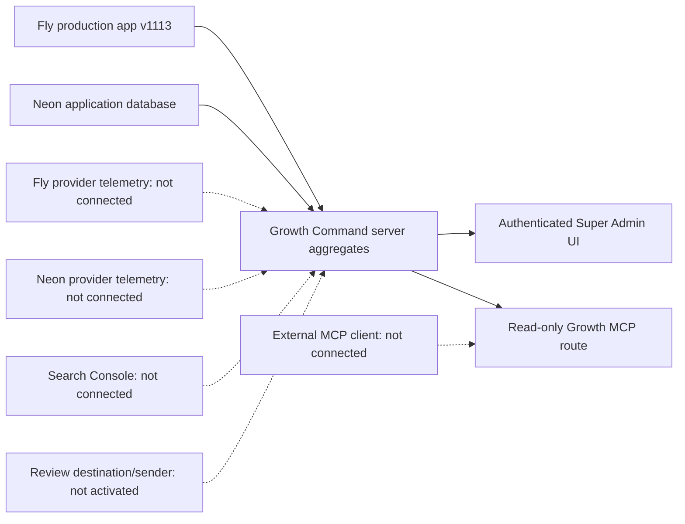

# GB-04E architecture — live baseline

- Provider absence is rendered as unknown/not connected, not healthy.
- Application database readiness is live; provider-level Neon telemetry is absent.
- Infrastructure mode is manual/recommendation-only; guarded auto is off.
- No provider secrets are available to the browser.
