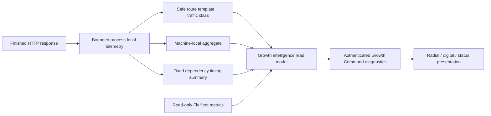

# GB-04F proposed architecture

All telemetry remains machine-local and volatile. Fly remains the sole fleet authority. The UI labels this scope and never combines an internal or low-sample p95 into a customer-health claim.
