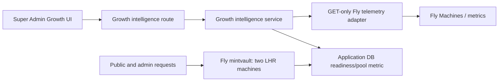

# Architecture — BEFORE — GB-04F

**Date captured:** 2026-08-20
**Captured from:** `git fetch origin main`, `/api/version`, `fly status --app mintvault`, Engineering OS preflight and the current code graph.

## Scope

Authenticated Super Admin Growth intelligence, its server-side Fly adapter and the production web fleet. Payment, Partner, Scanner and the separate AI programme remain outside the mutation scope.

## Current facts

| Fact | Evidence |
|---|---|
| Canonical main is `d67e3472` | `git fetch origin main` / `git rev-parse origin/main` |
| Production is still GB-04E candidate `1e868cc7` | `GET /api/version` |
| Fly fleet is healthy and unchanged | `fly status --app mintvault` |
| Existing Fly telemetry supplies fleet-level p95 but not route-class attribution | GB-04E implementation and task evidence; source verification pending |
| No scaling or automatic capacity control is available | GB-04E architecture and owner restrictions |

## Constraints

All timing data must be bounded and aggregated server-side; route templates must exclude query strings, identifiers, tokens and request payloads. The top-level customer health decision must not be poisoned by internal/admin telemetry.
