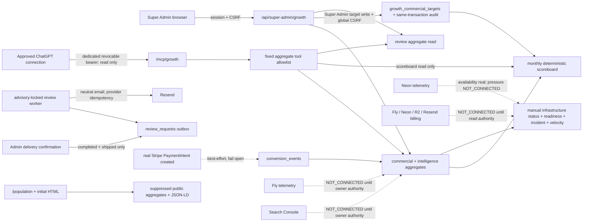

# Architecture — After (Frozen Design)

## Trust boundaries

- MCP can call only named aggregate tools; it has no DB/query parameter, lead detail, mutation, Super Admin session, payment, Partner, Scanner, infrastructure write, budget, spend or deploy capability.
- Commercial targets are never inferred. The only target mutation is a bounded current-month write behind the existing Super Admin session and global same-origin CSRF guard; it commits the target and generic audit evidence together. MCP can read target/actual/status but has no target-write tool.
- Review eligibility is server-derived from carrier delivery plus the completed/shipped/paid submission truth. Destination and recipient are server-owned; no client chooses either.
- Conversion event persistence is auxiliary and fail-open. It cannot change Stripe requests, fulfilment, prices, payment responses or customer identity.
- Public authority output comes from approved/public aggregates only and suppresses small samples; server metadata is allowlisted and safely serialized.
- Missing external credentials remain explicit states, not zero values or inferred telemetry.
- Infrastructure mode is `MANUAL` monitor/detect/recommend. `GUARDED AUTO` is documentation-only and needs a separate privileged identity, sustained/correlated evidence, hard machine/capacity/budget limits, cooldown, confirmation, audit, verification and rollback.

## Performance boundaries

- Growth snapshots and public aggregates are bounded/cached; no external provider call is made per browser refresh.
- Review work is advisory-lock serialized, atomically claimed and batch-limited.
- MCP has a strict request/tool/rate budget and returns aggregate DTOs only.
- Scoreboard reads one bounded current-month target/actual aggregate and uses deterministic elapsed-period pacing; no job, external call or browser-derived actual is involved.
