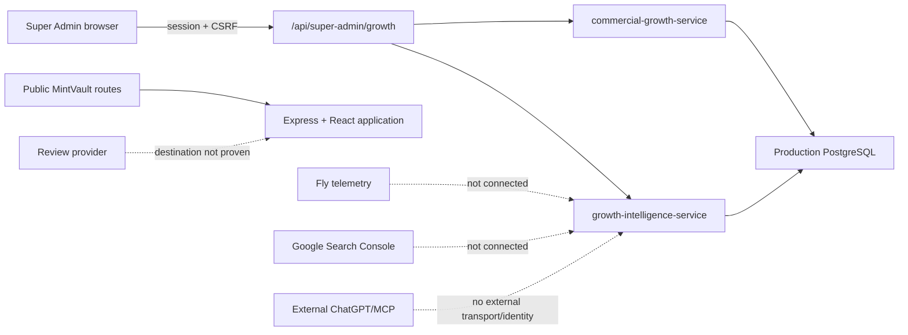

# Architecture — Before

**Captured:** 2026-08-19 from source, Fly status, `/api/version` and a read-only production DB query.

## Evidenced facts

- Production and main serve `facfd36f`; Fly v1109 has two healthy machines.
- Growth uses bounded Super Admin routes and aggregate-only services.
- Production journal is applied through `0100`; both existing Growth tables are present.
- Provider metrics, external MCP and conversion-start cohorts are absent/truthfully unavailable in GB-04B.

## Constraints

No payment, auth, MVGS, Partner operational, Scanner or secret boundary may change. Provider/data additions require bounded caches, privacy-safe aggregates and truthful failure states.
