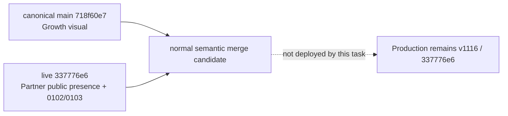

# Architecture — AFTER — Growth / Partner canonical reconciliation

**State:** PROPOSED (Stage 4)
**Date:** 2026-08-21

| Change | Why | Classification |
| --- | --- | --- |
| One normal merge commit retaining both ancestors | Prevent candidate deployment from dropping live Partner implementation while retaining approved visual work. | C/E |

## Deliberately unchanged

Production and staging runtime, migration journal, database schema, provider credentials/configuration, Fly/Neon/R2 resources, infrastructure capacity, payments, Scanner authority, Partner authority policy, and Growth visual behavior.

## AS-BUILT confirmation

The merge applied without conflicts. Local behavioral, migration/schema, typecheck, lint, build, Graphify and governance evidence is complete; independent hostile review and exact-SHA remote CI remain pending. It remains `not deployed` for this task.
