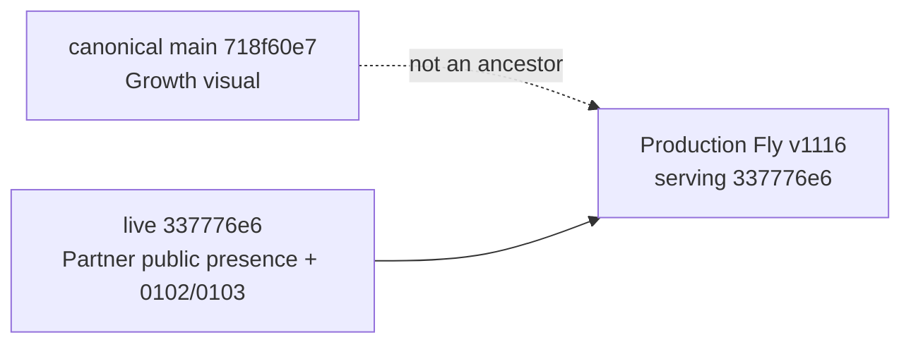

# Architecture — BEFORE — Growth / Partner canonical reconciliation

**Date captured:** 2026-08-21
**Captured from:** read-only `git fetch`, `git merge-base`, candidate/live diff, live `/api/version` and prior Fly status evidence.

## Scope

The only architectural issue is release ancestry: canonical main holds the approved Growth visual release, while the running production artifact holds the Partner public-presence release as a sibling history. Both use the same Fly application and production database, neither of which this task mutates.

| Fact | Evidence |
| --- | --- |
| Main and live code are sibling lineages | shared base `2d776db`, while `check-live-ancestry` rejected main as missing live commit `337776e6`. |
| Live-only data authority is migration-based | exact source files `migrations/0102_partner_public_presence.sql` and `0103_partner_google_presence.sql`. |
| Growth visual remains canonical main authority | approved visual merge SHA `718f60e7`; Growth page/test bytes are preserved in the in-progress merge. |

## Constraints

No migration may be applied, no provider may be connected, no credential or infrastructure may change, and no deployment can be initiated. The reconciliation must preserve Partner RLS/privacy and all protected payment, Scanner and admin boundaries.
