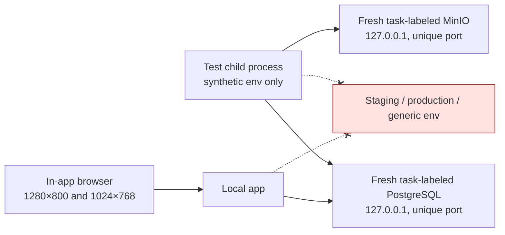

# Architecture — AFTER — mintvault-final-integration-local-proofs

**State:** AS-BUILT (Stage 7)
**Date:** 2026-08-10

## What changes vs BEFORE

| Change                                                                                                                | Why                                                                          | Classification |
| --------------------------------------------------------------------------------------------------------------------- | ---------------------------------------------------------------------------- | -------------- |
| Fresh local PostgreSQL and MinIO containers with task labels and unique ports.                                        | Execute formerly gated integration proofs without contact with live systems. | D/F            |
| Per-process generated environment values.                                                                             | Keep credentials non-persistent and prevent ambient configuration use.       | D/F            |
| Local browser journey using deterministic test identities.                                                            | Exercise actual route/UI wiring at requested viewports.                      | D              |
| Shared loopback TLS selection in application and session pools.                                                       | Make CI-shaped local PostgreSQL work without weakening remote TLS.           | A              |
| Non-cacheable Partner session, reversible `0068` migration, credit checkout/resume, and public-network client routes. | Repair reproduced HIGH defects and mount existing product contracts.         | A/D/E          |

## What deliberately does not change

Protected auth policy, MVGS logic, live R2 configuration/signing, Stripe settlement, `.env` files, staging, production, deploy state, and git remote state.

## AS-BUILT confirmation

All services were stopped after proof. No task-labelled container, app process, generated credential, database, or object-store data remains.
