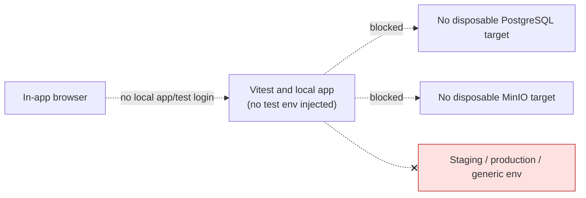

# Architecture — BEFORE — mintvault-final-integration-local-proofs

**Date captured:** 2026-08-10
**Captured from:** `.github/workflows/ci.yml`, `docker version`, `docker ps`, and current worktree inspection.

## Scope of this snapshot

Only the local test boundary: Vitest/application child processes, disposable PostgreSQL, and disposable MinIO. Existing Docker containers are not part of this task and will not be reused or modified.

| Fact                                                                                             | Evidence                                                      |
| ------------------------------------------------------------------------------------------------ | ------------------------------------------------------------- |
| CI uses loopback PostgreSQL and dedicated `PARTNER_REAL_R2_PROOF_*` values.                      | `.github/workflows/ci.yml:22-23`, `:77-90`, `:349-420`        |
| Real R2 proof refuses ambient `R2_*` configuration and allow-lists disposable endpoints/buckets. | `tests/partner-real-r2-storage.test.ts:20-55`                 |
| Existing local Docker containers already occupy CI-like ports.                                   | `docker ps` at Stage 0; no existing container will be reused. |
| No repository environment file is changed by this task.                                          | Stage 0 worktree inspection and explicit scope.               |

## Known constraints

- Test database and object storage are destructive only inside task-labeled local containers.
- Browser identities must be deterministic test data and must not alter auth implementation.
- No live R2 signing, MVGS, Stripe, production/staging systems, or generic `MINTVAULT_DATABASE_URL` may be used.
