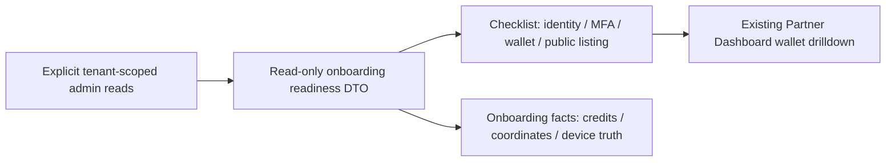

# Architecture — AFTER — mintvault-partner-onboarding-readiness

- The existing Super Admin route remains the read boundary. It derives a small, secret-free DTO
  from each user’s active MFA factor, the partner credit-availability projection, and that
  partner’s public listing.
- The UI makes each backed fact visible and links only to the already-shipped wallet drilldown.
  It does not add a credit mutation, public-listing writer, device registry, or scanner telemetry.
- No registry means device/station and scanner readiness remain explicitly unavailable rather than
  being rendered as zero, complete, or an actionable setup task.
