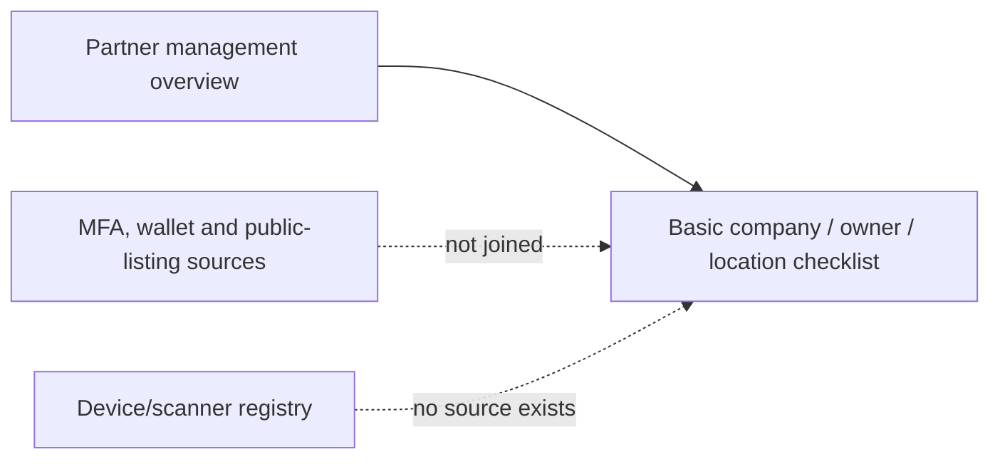

# Architecture — BEFORE — mintvault-partner-onboarding-readiness

- The Super Admin detail view exposed invitation/login readiness but did not surface the owner MFA
  factor, ledger-derived wallet/credit position, public-listing status, or coordinate state.
- Its legacy checklist incorrectly described credits as unavailable despite the shipped ledger and
  dashboard. Device/station and scanner telemetry still have no tenant-linked registry.
