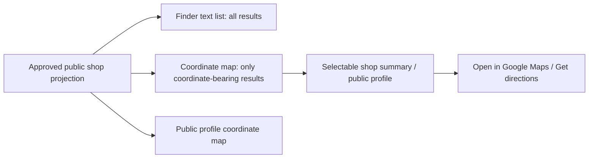

# Architecture — AFTER — mintvault-public-shop-map

- The browser renders a small coordinate plot from the existing approved shop coordinates; it does not
  call a map provider, geocode an address, or persist a visitor location.
- Pins are buttons, so each map-selected shop has an accessible profile summary and a normal public
  profile link. A missing coordinate shows no pin but never suppresses the shop's text result.
- Google Maps links are outbound navigation built from the approved coordinates, falling back to the
  approved public address where coordinates are unavailable.
