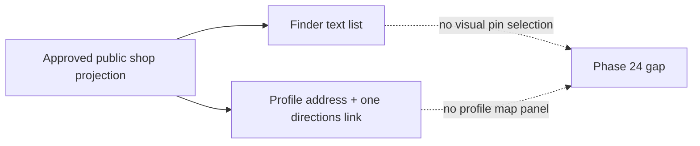

# Architecture — BEFORE — mintvault-public-shop-map

- `GET /api/shops` already returns only approved active listings and exposes an approved coordinate pair
  when one exists.
- The finder intentionally still returns coordinate-less shops as text results.
- Super Admin coordinate ownership is already enforced by the public-network administration route; the
  Partner self-service route cannot edit coordinates.
