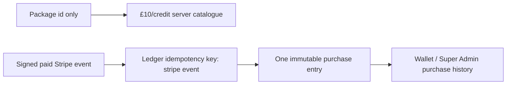

# Architecture — AFTER — mintvault-stripe-credit-purchase

- The new real PostgreSQL tests exercise the actual production fulfilment function, ledger unique
  constraint, balance projection and cross-tenant collision behavior.
- Stripe remains the authoritative event source; browser success redirects have no credit writer.
- No provider secret, live Checkout session, payment configuration, database migration or money
  behavior is changed.
