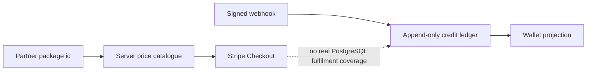

# Architecture — BEFORE — mintvault-stripe-credit-purchase

- The authoritative package catalogue, Checkout creator, webhook branch and idempotent ledger writer
  already exist.
- Pure tests prove malformed metadata and package rules, but the full paid fulfilment/replay path
  lacked a dedicated real-PostgreSQL proof across the actual credit-purchase service.
