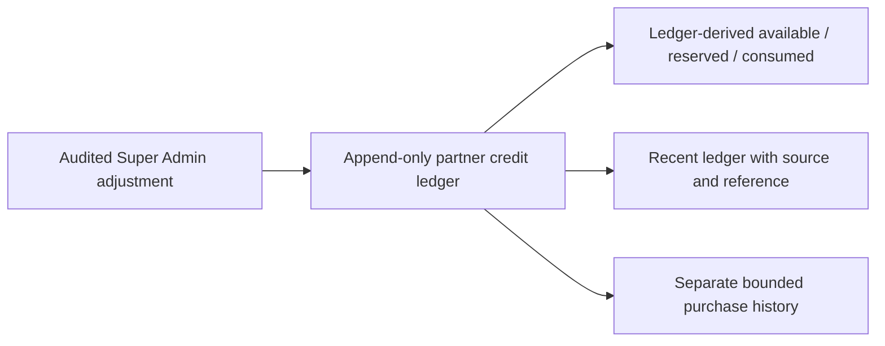

# Architecture — AFTER — mintvault-super-admin-credit-control

- Purchase history is a safe, bounded read from the immutable ledger; it is not a live Stripe call
  and cannot rewrite a payment result.
- The browser receives only snapshotted package, pence, currency and provider-reference fields.
- Partner selection remains in the server-owned dashboard route; adjustment actor and tenant are
  derived from the authenticated Super Admin and URL, and all balance changes stay append-only.
