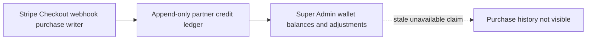

# Architecture — BEFORE — mintvault-super-admin-credit-control

- The Super Admin dashboard already derives wallet balances from the append-only ledger and uses
  the audited adjustment service for grants/corrections.
- The live partner credit Checkout webhook also writes `purchase`/`stripe` ledger entries, but the
  wallet DTO still labels purchase history unavailable. That operational claim is now false.
