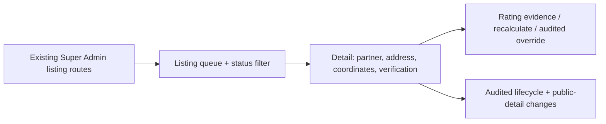

# Architecture — AFTER — mintvault-super-admin-public-listings

- The UI is a same-origin Super Admin client over the existing API. The server remains the sole
  authority for location tenancy, lifecycle transitions, coordinate pairing, rating calculation,
  overrides and audit.
- Creating a draft chooses only from a server-derived unlisted location; status, address,
  coordinates, verification and override actions send required human reasons where the existing
  endpoint requires them.
- No public projection, rating algorithm, migration, RLS policy, Partner self-service authority,
  object storage, payment, or scanner/device system is changed.
