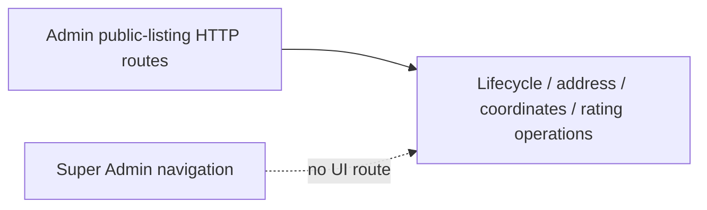

# Architecture — BEFORE — mintvault-super-admin-public-listings

- The existing server already owns listing lifecycle, public identity/address/coordinates, rating
  evidence/recalculation/override and audit. The browser exposes none of these operations as a
  Super Admin product screen.
- The Partner Dashboard labels rating/device gaps honestly but cannot inspect or govern public
  listing records.
