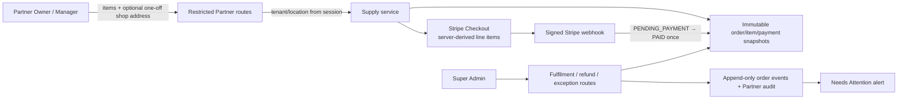

# Architecture — AFTER — mintvault-supplies-orders

- `partner_supply_products` holds the locked slab definition and configurable, possibly unpriced products.
- `partner_supply_tax_settings` begins explicitly `UNCONFIGURED`; each order/payment copies gross, VAT treatment, rate, net and VAT totals.
- Partner runtime is RLS-bound to its tenant and cannot update order/payment status, totals or refunds. It can append checkout evidence only.
- Delivery is an approved-location or authorised one-off snapshot. Customer records are never referenced.
- Refunds call the original Stripe payment mechanism. After dispatch/completion the only product action is a manual exception record and Needs Attention alert.
