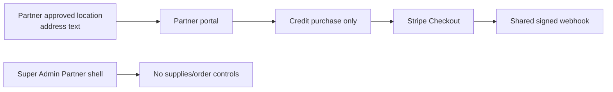

# Architecture — BEFORE — mintvault-supplies-orders

The repository has protected Partner tenant transactions, RBAC, location data and append-only audit events; it has no supply-order source of truth. Existing `partner.orders.*` permissions are not currently wired to a commercial order flow. Checkout currently exists only for grading credits and must not be repurposed to edit wallet balances.

## Design commitments

- Partner checkout reads its own tenant/location through `withTenant`; no request may choose tenant, product price, tax or order identity.
- A delivery snapshot records the location address or an authorised Owner/Manager override at checkout. It never reads a customer address.
- Orders/items/payment/refund snapshots are append-only evidence; terminal history is not deleted or rewritten.
- Stripe Checkout is used to collect the server-derived gross total; the verified webhook changes the order from `PENDING_PAYMENT` to `PAID`.
- A distinct per-order idempotency key, database unique constraints and audit rows collapse replayed webhooks/refunds.
- Tax remains initially `UNCONFIGURED`; the model preserves gross-only history and can later snapshot configured VAT-inclusive treatment without an order rewrite.
