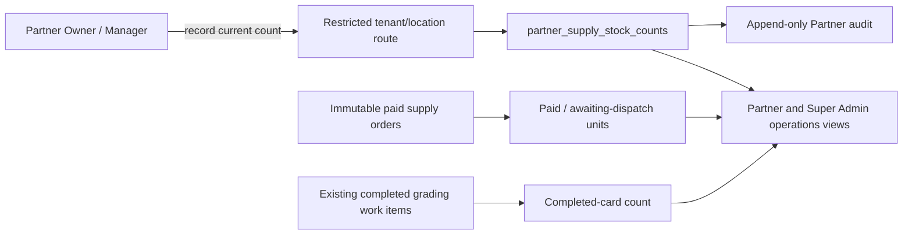

# Architecture — AFTER — mintvault-supply-operations

- `partner_supply_stock_counts` has one row per tenant, active location and canonical product. `known_units=0` is an intentional count; no row means `Not recorded`.
- RLS binds reads/writes to both the session tenant and selected location. Column grants prohibit the restricted runtime from changing the stock identity or deleting a count.
- Partner rows derive paid units from states that represent paid supply (excluding cancelled/refunded) and awaiting-dispatch units from `PAID`/`PROCESSING`; no browser total is accepted.
- Cards completed are counted from the existing per-card work-item current state. The UI says the figures are separate and does not present a fabricated remaining-stock value.
- Super Admin sees an aggregate of shop-recorded stock, number of counting shops, paid/awaiting units, and completed work items; it cannot make up a Partner count.
