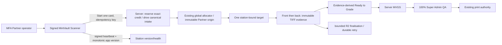

# Architecture — AFTER — Partner Pilot final-scale completion

**State:** PROPOSED (Stage 4)
**Date:** 2026-08-12

## Deliberately preserved

- No Scanner-local credit balance, target, MV number, grade, QA or print decision.
- Existing global transactional allocator and exact reservation invariant.
- Existing server-authoritative MVGS and print/QA boundary.
- Production topology remains fail-closed until separately corrected.

## AS-BUILT confirmation

Pending Stage 6. Any migration, live role, deployment, R2 or Canon evidence is not implied by this proposed architecture.
