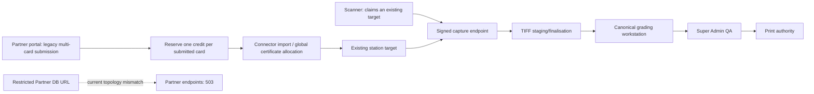

# Architecture — BEFORE — Partner Pilot final-scale completion

**Date captured:** 2026-08-12
**Captured from:** production `/api/version`/Partner endpoint probes; candidate `f3e90e63`; source tracing of Scanner, credit reservations, capture and grading routes.

## Scope

The constrained Partner runtime, Scanner-to-server capture flow, credit lifecycle, certificate allocator and grading/QA/print path.

## Evidenced facts

| Fact | Evidence |
|---|---|
| Live Partner endpoints fail safely | 503 responses recorded in `deployment-state.md` |
| Scanner cannot start a card | `scripts/scanner-app/renderer/app.js:537-559` requires an already armed target |
| Credit reservation occurs after legacy submission | `server/partner/submission-service.ts:894-927` |
| Current queue is not evidence-derived | `server/partner/grading-routes.ts:417-499` |

## Constraints

No scanner-local credit, target or MV-number authority; global allocator remains transactional; Partner data requires tenant/location/station provenance; the protected MVGS algorithm and label rendering are out of scope.
