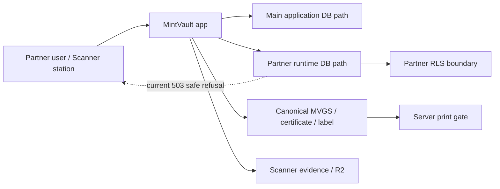

# Architecture — BEFORE — Partner Pilot Pass 2

**Date captured:** 2026-08-12
**Captured from:** `origin/main` at `864fadeda`, Pass 1 commit ancestry,
public production `/api/version`/`/health`/Partner probes, and existing
Partner runtime ledgers. Secret values were not inspected or recorded.

## Scope

The pilot boundary: Partner browser and scanner → Partner application routes →
restricted Partner runtime/Neon RLS → canonical grading, credit, QA, certificate
and label services → physical print.

## Current facts

| Fact                                                                    | Evidence                                                                                   |
| ----------------------------------------------------------------------- | ------------------------------------------------------------------------------------------ |
| Production serves `b0de0880` and health is OK.                          | `/api/version`, `/health` on 2026-08-12.                                                   |
| Production Partner public routes are closed with `503`.                 | Two public route status probes on 2026-08-12.                                              |
| Pass 1 server-authority code is not integrated into baseline.           | `git merge-base --is-ancestor 7368b07e origin/main` returned false; inverse returned true. |
| Pilot must remain fail-closed rather than use a privileged DB fallback. | Attached Pass 2 requirements and existing Partner runtime ledger.                          |

## Constraints

- No protected MVGS mathematics or label semantics may change.
- No secret/runtime role/migration/production action is permitted without a
  separate owner approval record.
- Pilot 1 requires 100% Super Admin QA and one canonical workstation/label
  renderer; adaptive QA is out of the critical path.
