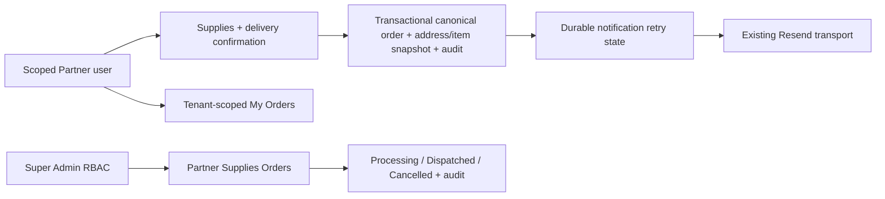

# Architecture after — Partner supplies ordering (proposed)

The final design must use one canonical order authority, fail closed for missing delivery data,
and make notification delivery retryable without creating a duplicate order.
