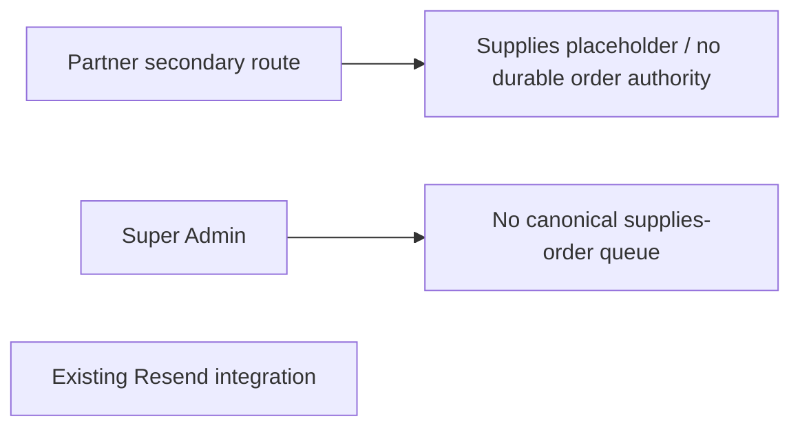

# Architecture before — Partner supplies ordering

At baseline, supplies are not a durable Partner-order workflow. Existing Partner addresses,
session scope, audit and Resend patterns must be inspected before defining the replacement.
