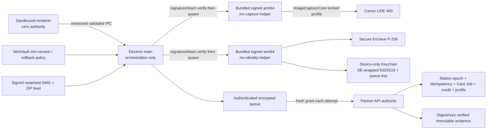

# Architecture — AFTER — Scanner SOL campaign

**State:** WP1 capture-helper, WP2 identity/client, WP3 live-authority and WP5 encrypted-queue edges AS-BUILT locally; server/package edges remain PROPOSED until frozen P14 and later WP verification.

## Intended changes

| Change | Why | Class |
|---|---|---|
| Precompiled helpers + runtime designated-requirement verification | Remove runtime toolchain and helper replacement | D/F |
| Native SE/Keychain identity and signing | Clone resistance and key isolation | D |
| Versioned schema-validated IPC | Renderer compromise containment | A/B |
| Server capture authorisation/profile/op-ID/epoch contracts | Preserve sole business authority | B/E (migration authored, application separately gated) |
| Encrypted queue + plaintext sweep + fresh grants/dispositions | Evidence confidentiality/durability | D/B |
| Electron builder/updater and policy checks | Production install/update/rollback | D/F |

## Deliberately unchanged

- Partner server owns every business decision.
- Protected MVGS calculation and grading boundaries.
- Production/staging/legacy cutover remain owner-authorised operations.

## AS-BUILT confirmation

WP1 confirms main-process configuration of one exact resource path and
verification of the capture helper's sealed digest, arm64 architecture, macOS
floor, signature, identifier, protocol and matching production Team ID before
every spawn.

WP2 confirms helper-owned Ed25519 generation/import/signing, device-only
SE-P256 wrapping, exact Keychain namespace enforcement, prove-then-retire v1
migration, separate human session storage, one process-wide signed-request
queue, durable exact-payload operation IDs and fail-closed identity recovery.
Production helper calls additionally require a signed parent matching app ID,
pinned Team and designated requirement. Production entitlements/package
execution and server epoch/idempotency/session authority remain later edges.

WP5 confirms that TIFF/Preview bytes enter a device-bound AES-256-GCM queue
with a fully authenticated index and immutable authority/provenance binding.
Plaintext is unlinked or swept to quarantine, each upload attempt requests a
fresh grant, and only a tuple-exact canonical server disposition permits local
resolution. Rescan replacement is atomic and ACCEPTED is a restart-convergent
deletion journal. The Partner API nodes remain proposed until frozen-P14
server semantics are reconciled and proven end to end.
