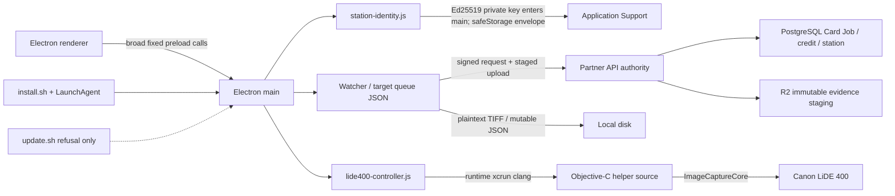

# Architecture — BEFORE — Scanner SOL campaign

**Captured:** 2026-08-14 from Git source `d44a2c53`, Graphify 0.9.39 and read-only Partner pass2 inspection.

## Current facts

| Fact | Evidence |
|---|---|
| ImageCaptureCore helper requests locked 1200-DPI RGB TIFF | `native/mintvault-lide-bridge.m` |
| Helper is compiled on the station | `lide400-controller.js` `/usr/bin/xcrun clang` |
| Identity private key is exportable in main memory and wrapped as one safeStorage envelope | `station-identity.js` |
| Target binding and staged exact-TIFF upload foundations exist | `watcher.js`, `server-client.js`, committed scanner services |
| Durable encrypted queue/disposition contract does not exist | Source inspection and canonical issue R-5/R-28 |
| Production package/updater/sign/notarise configuration does not exist | Scanner package/install/update inventory |

## Protected boundaries

- Partner server remains business authority; Electron cannot recreate RBAC, credits, Card Job, NEW/FIX or evidence acceptance.
- MVGS protected behavior is outside Scanner implementation authority.
- Apple credentials, staging/production and legacy cutover are owner/external gates.
