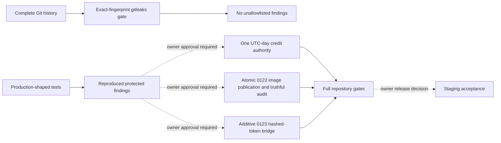

# Architecture — AFTER safe White Ace proof repairs

> **Scope correction:** “After” refers only to safe proof/scanner records in the nested
> White Ace slice. Product architecture was not repaired. The repository-wide target and
> phased recovery now live under `../repository-architecture-recovery-20260904/`.

**Date:** 2026-09-04  
**Candidate:** starting SHA `09beacaa5bc03f8e80e4c7e59232df6fc466b7cb` plus uncommitted proof/scanner/governance edits.

The product architecture is intentionally unchanged. This pass changed test fixtures/assertions, exact scanner fingerprints and evidence records only. It did not change routes, services, databases, migrations, object stores, authentication, payment, grading, providers, environments, CI execution or deployment.

## Intended protected target architecture (not implemented)

- One database-level UTC-day authority owns anonymous estimate reserve, comparison and refund.
- One 0122 object-write operation owns every certificate image upload, immutable object version, pointer finalisation and audit tuple.
- Each audit tuple identifies exactly the object bytes it hashes; original and derivative evidence are separate identities when both are recorded.
- One additive 0123 bridge writes only token digests, supports bounded rolling compatibility, exposes readiness, and atomically consumes stolen-report verification.

This document is a target boundary, not proof that those changes exist.
