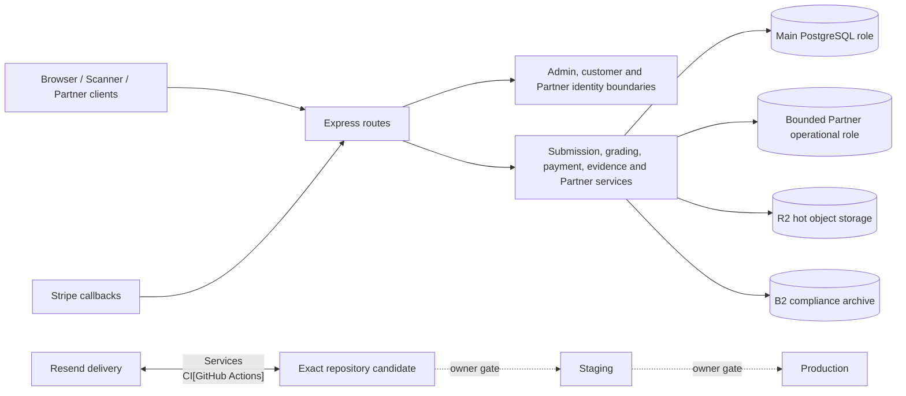

# Architecture — BEFORE — White Ace repository assurance

> **Scope correction:** This diagram is a release-boundary sketch, not the executable
> repository topology. It is superseded for architecture planning by
> [`../repository-architecture-recovery-20260904/architecture-topology.md`](../repository-architecture-recovery-20260904/architecture-topology.md).

**Date captured:** 2026-09-04  
**Captured from:** repository manifests, Graphify 0.9.39 code-only graph, source tree, migration registry, CI workflows, canonical issue register and proof ledger. No live provider or environment inspection is claimed.

## Scope

Repository, local/CI trust boundaries, application identity/tenant/payment/evidence/storage paths, and the staging/production evidence boundary.

## Current evidenced facts

| Fact | Evidence |
|---|---|
| Local candidate is clean and upstream-aligned | Git baseline at `09beacaa`; upstream divergence `0/0`. |
| Candidate is not a release proof | White Ace preflight `NOT_ESTABLISHED`; canonical register `NOT READY`. |
| Graphify navigation is current but not authoritative | `npm run graph:build` and `npm run graph:check`; source verification remains required. |
| Supply-chain/runtime pinning has an observed local failure | White Ace reports `WAA-SEC-022/022B FAIL` for non-exact Node `24`; Lead verification pending. |
| Local evidence cannot substitute for live configuration | White Ace evidence model and canonical `REL-ENV-001`. |

## Constraints

- MVGS v1.4 is frozen and cannot be edited.
- Auth, payment, migrations, storage-signing, certificate identity and dependency changes require explicit owner approval.
- No external system mutation or deployment is authorised.
- Existing stashes/worktrees are user-owned and out of scope.
