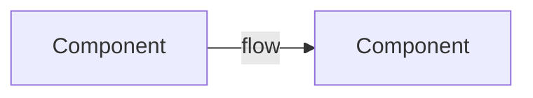

<!--
Template: Before Architecture snapshot (governance v1.1).
MANDATORY for classification D (infrastructure/config), E (migration),
F (external provider), and structural G (operational) work — plus any task
that changes storage or deployment topology. Written at Stage 1/2, BEFORE
any change, from the live system (not from memory).
-->

# Architecture — BEFORE — <task name>

**Date captured:** <YYYY-MM-DD>
**Captured from:** <live inspection commands used — e.g. fly status, information_schema query, git ls-files — not recalled from memory>

## Scope of this snapshot
<which slice of the system this covers — only the parts the task touches
plus their direct neighbours>

## Diagram

## Current state facts (evidenced)

| Fact | Evidence |
|---|---|
| <e.g. "vq_ tables absent on staging"> | <query output> |
| <e.g. "prod on commit abc123, release vNNN"> | </api/version output> |

## Known constraints in this area
<protected systems in play, invariants that must survive the change —
cross-reference .claude/controlled-code-lead/protected-systems.md>
