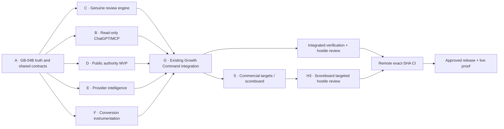

# Work Package DAG

## Parallel lanes

| Lane | Initial investigation ownership | File/domain boundary                                                | Dependency |
| ---- | ------------------------------- | ------------------------------------------------------------------- | ---------- |
| 1    | Growth/UI reviewer              | Existing Growth page, services, routes, tests and control inventory | A          |
| 2    | Reviews/data reviewer           | Completion authority, email delivery, schema and migrations         | A          |
| 3    | External/search reviewer        | MCP/provider/config/conversion/public SEO surfaces and CI/deploy    | A          |

Reviewers are read-only. The controller verifies and de-duplicates evidence before preparing any application change manifest.

## Release dependencies

- C cannot activate without an authoritative fulfilled/completed event and an approved review destination.
- B cannot expose externally without dedicated revocable, rate-limited Growth-read identity and audit.
- E cannot show provider values without real server-side provider authority.
- F must fail open and may not block checkout/payment.
- D must use only approved/public grades, minimum sample sizes and search-visible canonical output.
- G cannot release until existing Command Centre branch compatibility and every visible control are reconciled.
- S cannot invent a target, use a rolling window as a calendar month, count review requests as genuine reviews, or expose target mutation to MCP/AI. Its only mutation is an audited current-month target write through the existing Super Admin boundary.

## Current checkpoint

A–G, the Infrastructure/GBP addendum and their hostile reviews are complete locally. S is authorised as the next bounded package; H3 must reconcile its target authority, period pacing, genuine-review unavailable state and MCP non-mutation boundary. I (remote exact-SHA CI) has not started because the reviewed branch is not pushed and no pull request exists. J (migration/release/live proof) therefore remains closed.
