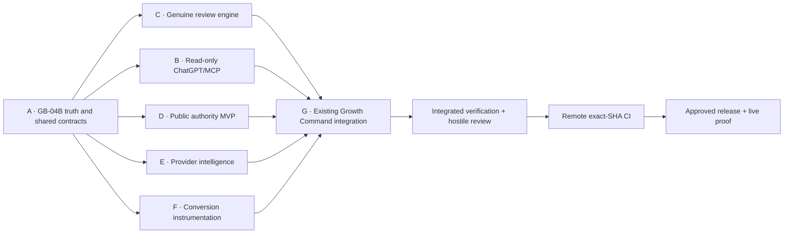

# Work Package DAG

## Parallel lanes

| Lane | Initial investigation ownership | File/domain boundary | Dependency |
| --- | --- | --- | --- |
| 1 | Growth/UI reviewer | Existing Growth page, services, routes, tests and control inventory | A |
| 2 | Reviews/data reviewer | Completion authority, email delivery, schema and migrations | A |
| 3 | External/search reviewer | MCP/provider/config/conversion/public SEO surfaces and CI/deploy | A |

Reviewers are read-only. The controller verifies and de-duplicates evidence before preparing any application change manifest.

## Release dependencies

- C cannot activate without an authoritative fulfilled/completed event and an approved review destination.
- B cannot expose externally without dedicated revocable, rate-limited Growth-read identity and audit.
- E cannot show provider values without real server-side provider authority.
- F must fail open and may not block checkout/payment.
- D must use only approved/public grades, minimum sample sizes and search-visible canonical output.
- G cannot release until existing Command Centre branch compatibility and every visible control are reconciled.

