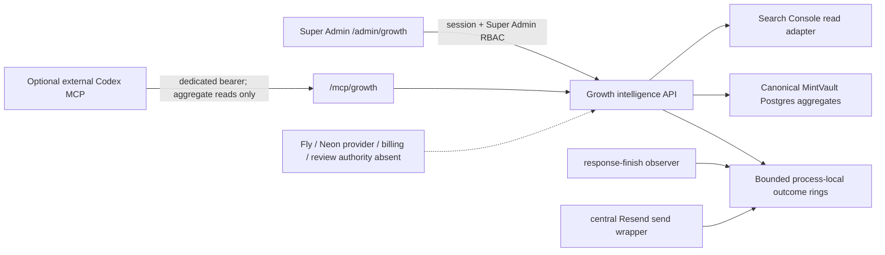

# GB-04D — Growth Command full activation handover

## Release identity and scope

GB-04D extends the existing Super Admin Growth Command with truthful application-process telemetry, database latency and pool-pressure signals, complete canonical funnel ratios, a dormant read-only Search Console adapter, radial status gauges, and UI/MCP hardening. It deliberately does not alter authentication semantics, Stripe/webhook processing, grading, Partner tenancy, Scanner authority, infrastructure capacity, provider spend, secrets, or database schema.

The release base is production commit `ee7fbe43e995b623b488bb9875ca37d261c2dfc4`, Fly release v1112. The local candidate is the current committed branch tip. Production activation remains gated by Git-push authority, independent hostile-review completion, terminal exact-SHA CI, staging proof, and final lineage reconciliation.

## As-built data path



## Authority matrix

| Surface                                     | Authority and window                                                                                                           | Connected state                          | Important limit                                                                                           |
| ------------------------------------------- | ------------------------------------------------------------------------------------------------------------------------------ | ---------------------------------------- | --------------------------------------------------------------------------------------------------------- |
| Revenue and commercial pulse                | Verified GBP paid submissions, `payment_timestamp`, rolling 60m                                                                | Existing DB authority                    | Minimum 3 paid submissions before velocity is rendered                                                    |
| Funnel                                      | Canonical `growth_conversion_events` plus verified paid cohort; selected London calendar period and like-for-like prior period | Connected                                | Missing stages remain unavailable, never coerced to zero                                                  |
| Request rate, p95 and 5xx                   | Volatile current-process `/api/` response ring; 5m rate and 60m latency/error window                                           | Connected for the process after deploy   | Not visitors, sessions, fleet totals, or durable history; cap makes state incomplete                      |
| Payment, Partner and Scanner outcome health | Fixed route families; successful, expected 4xx and platform 5xx outcomes; rolling 60m                                          | Connected for observed in-process routes | Expected auth/customer refusals are excluded; Stripe webhook is not claimed as durable delivery telemetry |
| Email outcome health                        | Central Resend call acceptance/error; rolling 60m                                                                              | Connected for process attempts           | Provider acceptance is not final delivery; signed webhook authority needs separate migration/approval     |
| Database availability                       | Existing readiness query                                                                                                       | Connected                                | Application availability only                                                                             |
| Database latency                            | Timed readiness query                                                                                                          | Connected                                | Application-path round trip, not Neon compute telemetry                                                   |
| Database pool pressure                      | Current Node `pg.Pool`: active/max/waiters                                                                                     | Connected                                | Current process pool only, not fleet or Neon connection estate                                            |
| Search Console                              | Google Search Analytics API, final data, server-side service-account JWT, 15m cache/24h last-valid fallback                    | Adapter built, external authority absent | Property is hard-allowlisted to `sc-domain:mintvaultuk.com` or `https://mintvaultuk.com/`                 |
| Fly machines/CPU/RAM/cost                   | No approved least-privilege server adapter                                                                                     | Not connected in the product             | CLI observation is release evidence, not an application data source                                       |
| Neon compute/storage/PITR/cost              | No Neon API authority                                                                                                          | Not connected                            | Application DB credentials are not provider-control credentials                                           |
| R2 cost/usage                               | No separate Cloudflare analytics/billing authority                                                                             | Not connected                            | Operational object credentials must not be reused for billing                                             |
| Review delivery/public rating               | No approved destination/provider authority                                                                                     | Not connected                            | Existing review lifecycle remains fail-closed                                                             |
| Active sessions/customers                   | No approved privacy-safe presence contract                                                                                     | Not instrumented                         | Request rate must never be relabelled as active users                                                     |

## Status thresholds and completeness

### Runtime requests

- Ring: maximum 20,000 `/api/` completion events over one hour.
- Rate: count in the last five minutes divided by five.
- Latency: 95th percentile over the one-hour process window.
- Error rate: HTTP 5xx divided by all one-hour process requests.
- Reaching the safety cap marks the window incomplete. An incomplete window is not allowed to imply a healthy fleet.

### Application outcomes

- `GREEN`: at least three successful classified outcomes, zero platform failures, complete bounded window.
- `AMBER`: one or more platform failures without the red sample/rate threshold.
- `RED`: at least five classified outcomes and either at least three platform failures or at least 20% platform-failure rate.
- `UNKNOWN`: no classified success/failure, fewer than three successes with no failure, or an incomplete capped ring.
- Expected 4xx authentication, authorization, validation, conflict and customer/payment refusals are counted separately and never treated as platform incidents.

### Database

- Latency: green below 250 ms, amber from 250 ms, red from 1,000 ms.
- Pool pressure: green below 70% with no waiter; amber from 70%; red from 90% or any waiting client.
- These thresholds apply to the current application process. They do not claim Neon compute-unit or fleet capacity.

### Capacity and readiness

The capacity model remains monitor → detect → recommend. A degraded expected fleet takes precedence and recommends `RESTORE_EXPECTED_FLEET`; request rate alone never creates amber/red capacity. Campaign Readiness is deterministic over site, payment, database, application error, Fly machine and capacity authorities. Missing provider telemetry returns insufficient telemetry, not green.

## Conversion contract

The Conversion tab now provides:

- submission-start → checkout-start percentage;
- checkout-start → verified-paid percentage;
- submission-start → verified-paid percentage;
- verified paid cards per paid order;
- the largest deterministically measured stage drop-off; and
- percentage-point comparison with the immediately preceding like-for-like London calendar window.

Every ratio names its canonical authority. The `all` period does not invent a comparable prior window and reports the comparison unavailable.

## Search Console activation

The adapter is entirely server-side, read-only and dormant unless both environment values exist:

- `SEARCH_CONSOLE_PROPERTY`: exactly `sc-domain:mintvaultuk.com` or `https://mintvaultuk.com/`.
- `SEARCH_CONSOLE_SERVICE_ACCOUNT_JSON`: a dedicated Google service-account JSON credential with read access only.

For each refresh it obtains a JWT access token scoped to `webmasters.readonly`, queries final Search Analytics totals, top five queries and top five pages, and obtains a previous-window click comparison where meaningful. Token/API requests time out after seven seconds. Raw tokens, credentials, payloads and provider errors never enter client data or logs.

Owner activation sequence:

1. In the signed-in `mintvaultuk@gmail.com` Search Console account, add and verify the `mintvaultuk.com` domain property using the exact DNS TXT value Google supplies.
2. Create a dedicated service account, grant it read access to that verified property, and retain no editor/owner permissions.
3. Approve the two server secrets above for staging first, then production after a real read and stale/error proof.

## Review activation

No current Google Business Profile or public review destination was found in the signed-in owner account. Create or claim and verify the official MintVault Business Profile, then approve its exact review URL and the existing sender/template policy. Only after that authority exists may the allowlisted destination and delivery provider be configured. Final Resend delivery/click/failure claims require signed webhook ingestion, a replay/idempotency design, migration approval, retention policy and focused tests; API acceptance alone is labelled sent/accepted, not delivered.

## Infrastructure and cost boundary

No infrastructure mutation UI or MCP tool is present. The current mode is fixed to `MANUAL / MONITOR_DETECT_RECOMMEND`; mutation and automatic scaling are false. Guarded Auto is unavailable.

A future Fly control package requires, at minimum: a short-expiry least-privilege write identity distinct from deploy/runtime reads; exact org/app allowlists; two-machine floor; configured maximum; plan/budget cap; current-state fingerprint; cooldown and idempotency; cost preview from billing authority; explicit confirmation; audit; rollback; concurrent-request tests; staging fault injection; and separate owner approval. Neon automatic mutation remains excluded.

Costs remain `NOT_CONNECTED` until dedicated read-only billing authorities supply source currency, period, timestamp and complete provider coverage. GBP total, cost/card and cost/order must stay unavailable until all inputs are current and currency conversion is authoritative.

## MCP connection

The Growth MCP transport remains aggregate-only and read-only. The rate limit now uses the proven Fly client-IP authority rather than direct proxy-derived `req.ip`. The Search Console read tool uses the same server adapter as the UI. There are no tools for infrastructure, campaign, payment, Partner, Scanner, credit, target, budget or provider writes.

External activation requires a dedicated high-entropy bearer value whose SHA-256 hash is stored server-side as `GROWTH_MCP_TOKEN_SHA256`. Keep the raw token only in a local secure environment variable such as `MINTVAULT_GROWTH_MCP_TOKEN`, then register:

```text
codex mcp add mintvault-growth --url https://mintvaultuk.com/mcp/growth --bearer-token-env-var MINTVAULT_GROWTH_MCP_TOKEN
```

Do not reuse a browser session, Super Admin password, database credential, Fly token or future infrastructure-write identity. Token creation, secret installation and local Codex configuration are owner-gated and were not performed by GB-04D.

## UI behaviour and zero-dead-controls result

- Growth tabs use the URL as the authority, so Back/Forward and deep links remain synchronized.
- Campaign link input changes and new generations clear stale Copy status.
- Status gauges are radial visual indicators derived only from server status; they show source, value/reason and timestamp and never create a synthetic percentage.
- Stale snapshots remain visibly labelled `STALE`.
- Existing period, refresh, Partner and campaign controls remain real. Provider/machine/CPU/RAM/Guarded Auto controls are not rendered without an authorized backend contract.
- Broken active controls found in the GB-04D source and focused interaction sweep: zero.

## Privacy and security

Runtime rings retain only timestamp, rounded duration, numeric response status, fixed service enum and fixed outcome class. They retain no URL, query, body, cookie, user/customer/admin/Partner identity, IP address, provider identifier, card/payment identifier or error message. The Super Admin session/RBAC boundary and existing CSRF policy are unchanged. Provider credentials stay server-side. The public health endpoint is unchanged and does not expose these details.

## Verification record

- Focused Growth suites: 7 files, 60 tests passed after implementation reconciliation.
- Broad no-env local regression: 334 files passed, 54 skipped, 6 failed files; 5,313 tests passed and 1,013 skipped. Failed files were `tests/auth-security-migration.test.ts` and `tests/rarity-structured-migration.test.ts` requiring `TEST_DATABASE_URL`, `tests/vq-backend.test.ts`, `tests/vq-fetch-art-stored-pointer.test.ts` and `tests/vq-higgsfield-observability.test.ts` requiring `MINTVAULT_DATABASE_URL`, plus one unrelated `tests/canonical-compact-workstation-density.test.ts` source-contract assertion reproduced identically on the untouched production baseline.
- Type check: passed.
- Lint: passed with zero errors; existing warning estate retained.
- Production build: passed.
- `git diff --check`: passed.
- Formatting for every changed product/test file: passed.
- Graph check: passed.
- Hostile/remote CI/staging/live rows must be filled only after their gates actually run.

## Release and rollback

There is no migration. The existing production journal was previously read as 64 applied/0 pending; it must be freshly rechecked before deployment. The candidate is committed locally; it must be independently reviewed, published only with Git-push authority, pass terminal remote CI for that exact SHA, and then pass staging desktop/mobile/auth/fallback checks before the already-recorded one-time production deployment approval becomes usable.

Rollback is an exact application artifact rollback to the pre-release image/source captured immediately before deployment. Expected rollback proof: two production machines started and healthy, `/api/version` restored, public revenue path and authenticated Growth/Partner/Scanner bounded smokes at their expected outcomes, and no schema/data rollback.

## External owner actions

| Provider                        | Exact owner action                                                                                                                       | What becomes live                                                                 |
| ------------------------------- | ---------------------------------------------------------------------------------------------------------------------------------------- | --------------------------------------------------------------------------------- |
| Git/GitHub                      | Approve publishing the exact reviewed `codex/growth-command-gb04d` candidate; no force push                                              | Exact-SHA remote CI and staging release gates                                     |
| Google Search Console           | Verify `mintvaultuk.com`, create read-only service account, grant property read, approve the two named staging secrets                   | Real impressions, clicks, CTR, average position, queries, pages and click trend   |
| Google Business Profile/reviews | Create/claim and verify official profile; approve exact public review URL and sender policy                                              | Review eligibility/scheduling can target a real public destination                |
| Resend                          | Approve signed webhook ingestion design, secret and additive migration                                                                   | Final delivered/clicked/failed delivery telemetry rather than API acceptance only |
| Fly telemetry                   | Create a short-expiry read-only organization token with exact MintVault org/app allowlist and approve server secret installation         | Fleet machine/CPU/RAM/request/latency/5xx provider metrics                        |
| Neon                            | Create a dedicated project/branch read-only API identity and approve exact scope/secret                                                  | Compute, storage and PITR provider facts                                          |
| Cloudflare/R2                   | Create separate Account Analytics Read/billing identity; never reuse operational object credentials                                      | R2 usage and billing facts                                                        |
| Provider billing                | Approve dedicated read-only billing scopes and GBP normalization authority for Fly, Neon, R2 and Resend                                  | Month-to-date costs, complete GBP total, cost/card and cost/order                 |
| Growth MCP                      | Generate dedicated token, install its SHA-256 server hash and local raw-token environment, then run the recorded `codex mcp add` command | External Codex read access to aggregate Growth tools                              |
| Privacy/legal                   | Approve a precise privacy-safe presence definition and retention model if active sessions/customers are still desired                    | A genuine presence metric; request count will not be relabelled                   |

## Non-claims

Until the corresponding authority and release gates are complete, GB-04D does not claim fleet-wide traffic, active users, delivered email, live Search Console, public rating, provider costs, provider capacity, production MCP connectivity, infrastructure control, Guarded Auto, remote-CI success, staging activation or production activation.
