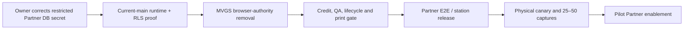

# Partner Pilot Plan — reconciled 2026-08-12

## Executive verdict

**Three serious engineering passes remain before a real external Partner card can be attempted, plus two owner-operated gates.** This is deliberately more than the two-pass target because the live system still has three release-blocking gaps: the Partner runtime is closed by an invalid production database host, the browser bundle contains the protected MVGS engine, and there is no Partner QA state machine/tenant-scoped QA print gate. Partner credit purchase is also not implemented; only credit grant/reservation code exists.

The two owner-operated gates are: (1) correct the existing restricted Partner runtime secret to point to the real same-Neon host, without using a `BYPASSRLS` credential; and (2) complete the physical Scanner/canary acceptance after a compatible release is live. Neither can be substituted with source inspection or a local test.

### Reconciliation boundary

| Authority                    | Observed state                                                                                                                   | Consequence                                                                                       |
| ---------------------------- | -------------------------------------------------------------------------------------------------------------------------------- | ------------------------------------------------------------------------------------------------- |
| Working checkout             | `70307beda542c71b1d067230096ac7bd3878bb53`, branch `psp/partner-rbac-hybrid`, with unrelated in-progress LiDE work               | Do not deploy or merge from this checkout. Preserve its dirty files.                              |
| Deployment lineage           | `origin/main` at `864faded`; production currently serves `b0de0880` (Fly v1076)                                                  | All release work must begin from the current mainline/production ancestry, not this checkout.     |
| Live read-only probe         | `/health` = 200; `/api/partner/me` = 503; `/api/partner/stations/enrolment-locations` = 503                                      | The Partner surface is safely unavailable, so no tenant or station workflow can currently run.    |
| Runtime configuration record | The 2026-08-12 configuration record captured the literal host `NEON_HOST_HERE` in `PARTNER_DATABASE_URL`; the mount fails closed | An owner must reset the secret with the real restricted-login URL. No code fallback is permitted. |

## System map

| Area                 | Actual owner/surface                                                            | Reconciled evidence                                                                                                                     |
| -------------------- | ------------------------------------------------------------------------------- | --------------------------------------------------------------------------------------------------------------------------------------- |
| Admin / Staff        | Existing React grading workstation and Express admin/staff routes               | `client/src/components/grading/grading-panel.tsx`, `server/grader.ts`, `server/routes/grader.ts`, `server/routes/staff.ts`              |
| Partner              | One mounted Partner API plus React portal                                       | `server/partner/mount.ts`, `server/partner/{routes,grading-routes,submission-routes,station-routes}.ts`, `client/src/pages/partner/*`   |
| Scanner              | Electron app, signed station identity, target-bound capture and staged evidence | `scripts/scanner-app/`, `server/lib/scanner-auth.ts`, `server/scanner-capture-service.ts`, `server/scanner-evidence-staging-service.ts` |
| MVGS                 | Shared pure engine currently used by both server and browser                    | `shared/mvgs-scoring.ts`, `shared/mvgs-input-builder.ts`, `server/mvgs-scoring.ts`, `client/src/components/grading/grading-panel.tsx`   |
| Certificate identity | Transactional global allocator                                                  | `server/storage.ts#getNextCertId`, `server/scan-ingest-service.ts#createCertForScan`, `tests/certificate-allocator-concurrency.test.ts` |
| Credits              | Partner wallet, append-only ledger and per-card reservation/settlement services | `migrations/0016`, `0017`, `0041`–`0043`; `server/partner/partner-{wallet,credit-reservation,submission-credit-lifecycle}-service.ts`   |
| Evidence             | Server-minted staged-object identity, immutable revision and durable jobs       | `migrations/0045`–`0047`, `server/scanner-evidence-*`, `server/scanner-processing-queue.ts`                                             |
| Print                | Existing Admin/Staff print lifecycle is grade-approval-gated                    | `shared/print-lifecycle.ts`, `server/print-workflow.ts`, `server/routes/print-workflow.ts`                                              |
| QA                   | No Partner grading QA domain was found                                          | No `partner_qa*` schema/routes/services/tests; current `qa` hits are unrelated Vault Quest or legacy workflow labels                    |

## Gap matrix

Statuses distinguish code, schema, configuration and deployment. “Built-needs-proof” is not a release claim.

| Requirement                                     | Status                | Code / schema evidence                                                                                                                                         | Deployment or proof gap                                                                                                                                                                                                                                         |
| ----------------------------------------------- | --------------------- | -------------------------------------------------------------------------------------------------------------------------------------------------------------- | --------------------------------------------------------------------------------------------------------------------------------------------------------------------------------------------------------------------------------------------------------------- |
| 6.1 Partner login → one-card grading journey    | **PARTIAL**           | MFA, Partner shell, submissions, billing and grading adapter exist (`client/src/pages/partner`, `server/partner/*`)                                            | Live mount is 503; flow remains submission/customer-centric and includes Partner customer records, contrary to the no-intake-PII pilot rule.                                                                                                                    |
| 6.2 Credits                                     | **PARTIAL**           | Wallet, ledger, per-card reservation and expiry code; real-Postgres service tests                                                                              | `0041`–`0043` are intentionally unapplied in production. `tests/partner-dashboard-ui-render.test.ts` confirms no Partner Stripe purchase path exists. No end-to-end Partner payment/reconciliation proof.                                                       |
| 6.3 Pilot-1 100% QA                             | **MISSING**           | Existing print requires `grade_approved_at`; this is not a Partner QA queue                                                                                    | No QA state, decision CAS, reviewer/audit model, queue or return-for-correction routes/tests.                                                                                                                                                                   |
| 6.4 Risk QA                                     | **DEFERRED**          | None required for Pilot 1                                                                                                                                      | Build only after Pilot-1 QA is proven, behind the specified flag.                                                                                                                                                                                               |
| 6.5 Server print gate                           | **PARTIAL**           | Canonical Admin/Staff print state machine and reprint reasons exist                                                                                            | No Partner-specific policy requiring tenant, evidence, credit settlement, QA clearance, immutable origin and approved station; no wrong-tenant or QA-hold print proof.                                                                                          |
| 6.6 Global MV number / Scanner acknowledgement  | **BUILT-NEEDS-PROOF** | Allocator is transactional and idempotent; the live `b0de0880` lineage contains it. Disposable PostgreSQL tests exercise 200/500/1,000 concurrent allocations. | Need current-main HTTP capture-to-ack proof and physical persistent Scanner popup proof. Never reserve a production number for testing.                                                                                                                         |
| 6.7 Scanner identity, station and Canon flow    | **PARTIAL**           | Signed Mac identity, station approval/calibration, staged TIFF pipeline and active local Preview/Accept pass exist                                             | Partner runtime 503 blocks enrolment. Current LiDE changes are local/uncommitted and physical calibration/acceptance is incomplete. No production release claim.                                                                                                |
| 6.8 Immutable evidence / R2                     | **BUILT-NEEDS-PROOF** | `0047`, staging grants/finalisation, durable queue and disposal tests exist                                                                                    | Dedicated non-production R2 bucket/policy is unavailable, so direct PUT/finalise/retry/cleanup and load proof are blocked.                                                                                                                                      |
| 6.9 Corrections, revisions and origin snapshots | **PARTIAL**           | `0035_partner_certificate_origin.sql` is live; grading revision/CAS work exists in mainline                                                                    | No Partner QA return/correction loop tied to the same certificate/credit/print revision.                                                                                                                                                                        |
| 6.10 Partner/Super Admin operations surfaces    | **PARTIAL**           | Dashboard, billing, submissions, users, locations, station and Partner-management UI exist                                                                     | Operational queues requested for scan/grade/QA/print/history are incomplete and not live because the mount is closed.                                                                                                                                           |
| 6.11 Canonical lifecycle                        | **MISSING**           | Separate credit, capture, grade and print state models exist                                                                                                   | No one server-owned transition model spans required evidence, MVGS, credit, QA, print and completion; illegal-transition matrix is absent.                                                                                                                      |
| 6.12 Audit and data protection                  | **PARTIAL**           | Audit tables/services and provenance snapshots exist; station/credit events are recorded                                                                       | Need one timeline proof covering every Partner action. Existing Partner customer creation/search must be removed or excluded from Pilot intake.                                                                                                                 |
| 6.13 Scale / operations                         | **PARTIAL**           | Bounded station expiry, durable jobs, staging cleanup and allocator stress proof exist                                                                         | No non-production R2 proof, multi-replica capture load run, measured pool behaviour or 1,000-operation acceptance record.                                                                                                                                       |
| MVGS server authority                           | **BLOCKED**           | Server reuses the protected engine, but the browser directly imports `computeMvgsScore`, `scoreMvgsV2`, grade mapping and pristine helpers                     | This leaks protected computation to the browser and lets the UI calculate grade candidates. Replace client computation with server-authored preview/result data without changing MVGS maths; prove with bundle inspection, HTTP tamper tests and parity corpus. |
| Tenant isolation / emergency stop               | **BUILT-NEEDS-PROOF** | Restricted runtime design, RLS and fail-closed mount; current 503 confirms unsafe configuration is not served                                                  | Correct the real runtime credential, then run real Partner-role HTTP/RLS tests. `partner_emergency_stop` exists; required pilot flag names must be reconciled.                                                                                                  |

## Critical path and ownership

| Surface                 | Real paths                                                                                                       | Ownership rule                                                                                      |
| ----------------------- | ---------------------------------------------------------------------------------------------------------------- | --------------------------------------------------------------------------------------------------- |
| MVGS engine/grade write | `shared/mvgs-scoring.ts`, `shared/mvgs-input-builder.ts`, `server/grader.ts`, `server/partner/grading-routes.ts` | Lead-serial; no maths/threshold/weight change.                                                      |
| Certificate allocator   | `server/storage.ts`, `server/scan-ingest-service.ts`                                                             | Lead-serial; preserve transaction/idempotency invariants.                                           |
| Credit settlement       | `server/partner/partner-credit-*.ts`, `server/partner/partner-submission-credit-lifecycle.ts`                    | Lead-serial; monetary changes require explicit owner confirmation before implementation/deployment. |
| QA/lifecycle/schema     | `shared/partner-schema.ts`, `shared/schema.ts`, numbered migrations, new QA service                              | Lead-serial; additive migration and real-Postgres proofs.                                           |
| RLS/auth/mount          | `server/partner/{db,mount,auth,permissions}.ts` and migrations                                                   | Lead-serial; no fallback to the owner connection.                                                   |
| Scanner product         | `scripts/scanner-app/**`, station/capture/evidence services                                                      | May proceed after the above contracts are fixed; physical actions remain owner-gated.               |
| Partner/Admin UI        | `client/src/pages/partner/**`, `client/src/pages/admin/**`                                                       | Parallel only after API/lifecycle contract is frozen.                                               |

## Confirmed pass scopes

### Pass 1 — authority and backend closure (must complete)

1. Start from the current mainline deployment ancestry and preserve all existing release fixes.
2. Remove protected MVGS execution from every browser bundle. The browser can submit inputs and display a server response only; the server is the sole source of overall grade, subgrades, Pristine, Black Label and printability. Add HTTP tamper, bundle-leak, parity and historical-grade regression proof.
3. Implement the canonical, audited Partner lifecycle; add 100% QA decisions with CAS, a Partner correction return path, server-side credit settlement, and a print gate that reads the same authoritative state.
4. Add only the rollout flags that the pilot needs: `partner_login`, `partner_grading`, `partner_printing`, `risk_qa`, `scanner_min_version`, and `emergency_stop`; map or retire the pre-existing names deliberately rather than adding parallel semantics.
5. Complete the Partner Stripe purchase/fulfilment/reconciliation path or explicitly constrain Pilot 1 to audited admin-granted credits. Any Stripe modification requires the owner’s confirmation under `CLAUDE.md`.

**Pass-1 proof:** real PostgreSQL route and transaction tests; targeted mutation tests for grade tampering, credit double-spend, QA/print bypass and tenant crossover; typecheck, build and CI-equivalent suite. No production migration/deploy in this pass without a clean, ancestor-valid candidate and explicit owner authorisation.

### Pass 2 — Partner E2E, station/scanner and print (must complete)

1. Build the Partner dashboard/new-grading adapter over the one canonical workstation; do not fork a grading UI or card model.
2. Finish Scanner Login, active Front/Back scan and persistent registered-MV reference package/product from the existing Admin visual language.
3. Make the QA queue/review/return and Partner ready-to-print/history surfaces usable under actual Partner RLS, not an Admin simulation.
4. Prove label/reprint policy on the server, then test a physical label through the supported printer.

**Pass-2 proof:** HQ dry-run using a real Partner account, signed-station enrolment/revocation, physical canary, 25–50 capture reliability record, and the Appendix A owner acceptance sequence.

### Pass 3 — release hardening and controlled pilot (must complete because current code/config gaps exceed two passes)

1. Complete the non-production R2 direct-upload/finalise/recovery and realistic load proofs.
2. Deploy only a clean candidate whose ancestry contains production; record migration inventory, rollback target and evidence package.
3. Correct the external Partner runtime configuration through the owner-controlled secret change, re-prove the runtime role and flags, and enable one pilot Partner only.
4. Run the physical canary, acceptance session and controlled 20–50-card pilot. Adaptive QA and broad scale rollout remain out of scope.

## Owner actions genuinely remaining

1. **Required before any Partner runtime release:** in Neon, create/verify the restricted `partner_runtime_app` LOGIN and reset `PARTNER_DATABASE_URL` with the real same-Neon host; keep `PARTNER_MFA_ENC_KEY` present. The current placeholder host causes the observed 503. This is a production secret/database action and cannot be safely inferred or performed here.
2. **Required before a physical canary:** place/flip the disposable card and confirm the real printed label/slab checks in the Appendix A acceptance block.
3. **Required before implementing or enabling Partner Stripe purchase:** confirm whether Pilot 1 should remain audited-admin-credit only or authorise the money-flow change. The repository confirms that Partner Stripe purchase does not currently exist.

## Evidence ledger and proof expiry

| Claim                                         | Current proof                                                                                                       | Status                          | Invalidated by                          |
| --------------------------------------------- | ------------------------------------------------------------------------------------------------------------------- | ------------------------------- | --------------------------------------- |
| Live Partner unsafe configuration is closed   | 2026-08-12 public probes: both Partner endpoints return 503; the configuration record captures the placeholder host | Proven safe refusal             | Any Partner secret/flag/deploy change   |
| Allocator preserves committed global identity | `tests/certificate-allocator-concurrency.test.ts`; allocator code is ancestor of live `b0de0880`                    | Built-needs-current-route-proof | Allocator, raw INSERT or schema changes |
| Browser must not own MVGS                     | Direct browser imports in current live lineage                                                                      | Reproduced blocker              | Client/engine/build changes             |
| Partner payment purchase exists               | `tests/partner-dashboard-ui-render.test.ts` pins its absence                                                        | Reproduced missing capability   | Billing/Stripe/webhook changes          |
| Pilot QA gate exists                          | No Partner QA schema/service/route/test found                                                                       | Reproduced missing capability   | QA/lifecycle/print changes              |

## Executive verdict

**Three serious engineering passes remain before a real external Partner card can be attempted, plus correction of the production Partner runtime secret and physical owner acceptance.** The shortest credible route is to repair server-only MVGS authority and the unified credit/QA/print lifecycle on current mainline first, then prove the real Partner/station flow, and only then correct production configuration and run the canary. Do not deploy this dirty, 72-commit-behind checkout.
